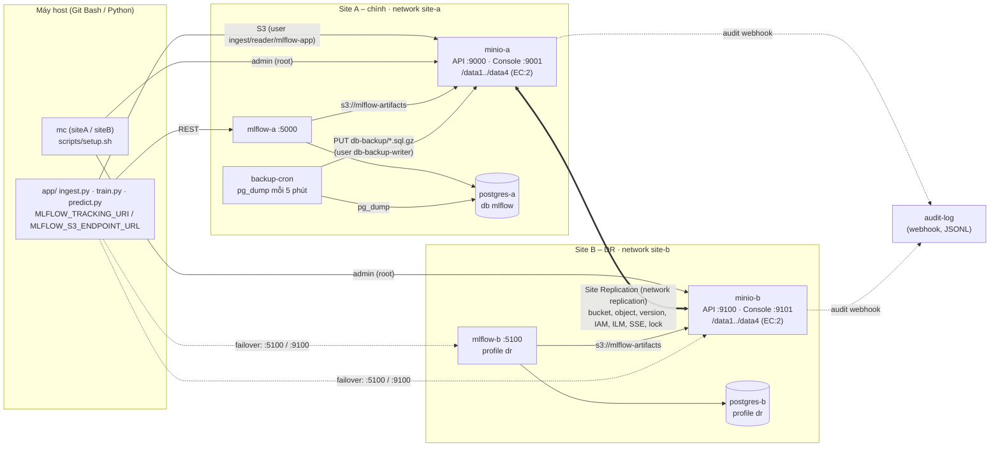

# Kiến trúc: lưu trữ, sao lưu & DR đa site cho hệ thống dự báo thời tiết

## 1. Sơ đồ

Network:

| Network | Thành viên | Mục đích |
|---|---|---|
| `site-a` | minio-a, postgres-a, mlflow-a, backup-cron, audit-log | nội bộ site A |
| `site-b` | minio-b, postgres-b, mlflow-b, audit-log | nội bộ site B |
| `replication` | minio-a, minio-b (+ `mc` tool khi setup) | hai MinIO nhìn thấy nhau cho Site Replication |

Endpoint ngang hàng của Site Replication là `http://minio-a:9000` và `http://minio-b:9000` (tên trên network
`replication`). Không dùng `localhost:9100` vì bên trong container minio-a, localhost là chính nó.

## 2. Dung lượng khả dụng theo erasure coding

Cấu hình đã dùng: mỗi site có **1 node × 4 drive** (`server /data{1...4}`), nên 1 erasure set có stripe = 4.
MinIO chọn parity mặc định **EC:2** cho 4 drive (lệnh `mc admin info siteA`: `4 drives online, EC:2`,
`standardSCParity=2`, `rrSCParity=1`).

| Storage class | Data (K) + Parity (M) | Hiệu suất (K/N) | Hỏng tối đa, vẫn ĐỌC | Hỏng tối đa, vẫn GHI | Ví dụ 4 × 100 GiB |
|---|---|---|---|---|---|
| **STANDARD (mặc định, đang dùng)** | 2 + 2 | **50 %** | 2 drive | 1 drive (write quorum = K+1 = 3) | **200 GiB** khả dụng |
| REDUCED_REDUNDANCY (`x-amz-storage-class`) | 3 + 1 | 75 % | 1 drive | 1 drive (write quorum = K = 3) | 300 GiB |
| Nếu đặt `MINIO_STORAGE_CLASS_STANDARD=EC:1` | 3 + 1 | 75 % | 1 drive | 1 drive | 300 GiB |

Toàn hệ thống có 2 site nhân bản đầy đủ (active-active), nên dung lượng khả dụng cho dữ liệu người dùng là
`min(site A, site B)` = 50 % dung lượng thô của một site, tức 25 % tổng dung lượng thô của cả hai site.
Đổi lại, hệ thống chịu được mất 2 drive trên mỗi site **hoặc** mất nguyên một site.

> Lưu ý demo: 4 "drive" là 4 Docker volume trên cùng một đĩa ảo của Docker Desktop, nên `mc admin info` báo tổng
> dung lượng của đĩa ảo (~1.9 TiB) chứ không phải đĩa vật lý riêng. EC ở đây minh họa việc chịu lỗi *mất/hỏng
> drive* (xóa nội dung một volume), không bảo vệ khi hỏng đĩa vật lý thật của laptop.

## 3. Phân loại dữ liệu & RPO/RTO mục tiêu

| Dữ liệu | Vị trí | Mức quan trọng | Cơ chế bảo vệ | RPO mục tiêu | RTO mục tiêu |
|---|---|---|---|---|---|
| Dữ liệu thời tiết thô (CSV theo lô) | `raw-data` | Cao (nguồn để train lại) | EC:2 · versioning (noncurrent giữ 14 ngày) · Site Replication bất đồng bộ · SSE-S3 | ≈ vài giây (độ trễ replication) | ≤ 15 phút (đổi `MLFLOW_S3_ENDPOINT_URL` sang :9100) |
| Artifact model (model.pkl, MLmodel…) | `mlflow-artifacts` | Rất cao (phục vụ dự báo) | EC:2 · versioning · Site Replication · SSE-S3 | ≈ vài giây | ≤ 30 phút (bật `mlflow-b`) |
| Metadata MLflow (run, param, metric, registry) | PostgreSQL `postgres-a` | Rất cao | `pg_dump` 5 phút/lần → `db-backup` (được replicate) | ≤ 5 phút (chu kỳ cron) | ≤ 30 phút (bật profile `dr`, restore dump mới nhất vào `postgres-b`) |
| Bản backup DB | `db-backup` | Tối quan trọng (chống ransomware / xóa nhầm) | Object Lock **COMPLIANCE 1 ngày** (WORM) · ILM xóa sau 7 ngày · versioning · Site Replication · SSE-S3 · user chỉ ghi, không xóa | = RPO của DB (5 phút) | — (là nguồn khôi phục) |
| Log ứng dụng | `logs` | Thấp | Site Replication · ILM hết hạn 30 ngày | Best effort | ≤ 24 giờ |
| Audit log MinIO | volume `audit-logs` | Trung bình (điều tra sự cố) | Webhook → JSONL | Best effort | Không yêu cầu |

Ghi chú:
- Site Replication là **bất đồng bộ**, nên RPO khác 0 nhưng rất nhỏ. Xem hàng đợi bằng `mc admin replicate status siteA`.
- RPO của metadata do chu kỳ cron quyết định (đổi `BACKUP_SCHEDULE` trong compose). Nếu cần RPO gần 0 thì
  dùng streaming replication PostgreSQL (ngoài phạm vi demo).
- Không nhân bản `postgres-a` sang B ở mức DB, vì `postgres-b` chỉ bật khi failover (profile `dr`).
- Failover DB: `make dr-up && make dr-restore` (nạp dump mới nhất từ `siteB/db-backup`).
